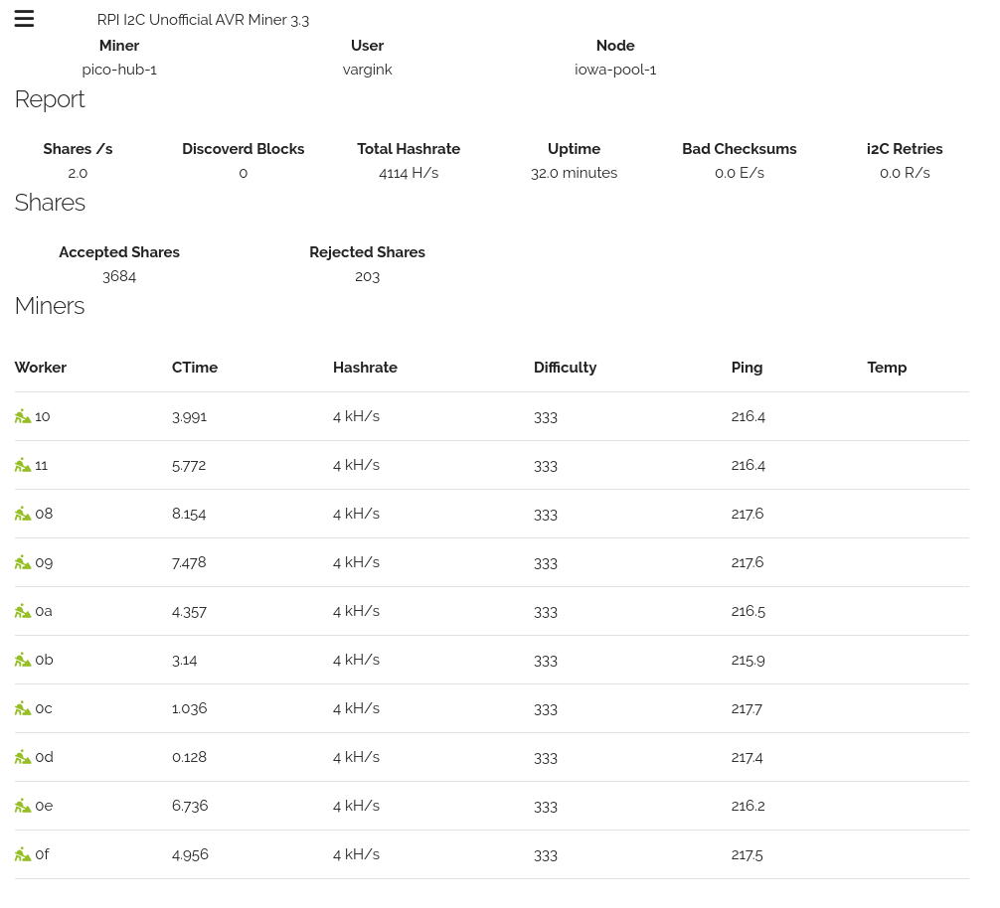

# DuinoCoinI2C_RPI_WEB
[JK-Rolling's DuinoCoinI2C](https://github.com/JK-Rolling/DuinoCoinI2C_RPI) miner now with a webui basically the exact same as his repo except the AVR_Miner_RPI.py has been modified to put the worker information into a web front end.

Once running you can access it via [https://127.0.0.1:8000](https://127.0.0.1:8000) using i2c 1, You can also access this remotely via public ip address. If you are running this in dual master mode this will also grab the second miners details and put it into the one interface.



## Video Tutorial

If you would like to know how to setup your miner please goto [JK-Rolling's DuinoCoinI2C github](https://github.com/JK-Rolling/DuinoCoinI2C_RPI) and read his guide there. This will be more up to date than this repo and you should do your testing with his before loading this up as debugging will be a lot easier.

## Python Environment Setup

### Linux

```BASH
sudo apt update
sudo apt install python3 python3-pip git i2c-tools python3-smbus screen -y # Install dependencies
git clone https://github.com/o850cHQk/DuinoCoinI2C_RPI_WEB.git # Clone DuinoCoinI2C_RPI repository
cd DuinoCoinI2C_RPI_WEB
python3 -m pip install -r requirements.txt # Install pip dependencies
````
